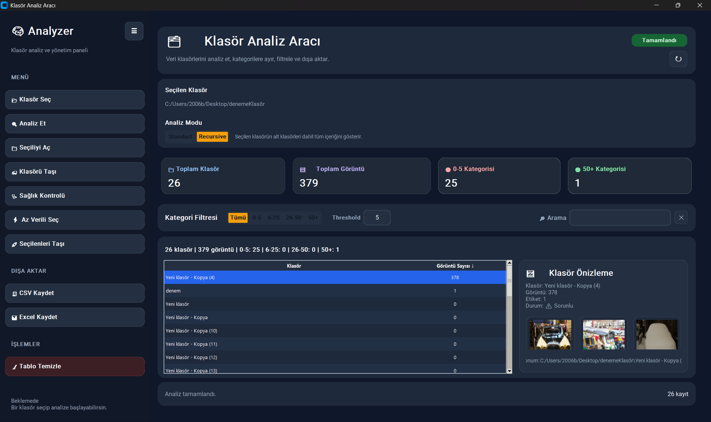

# 📂 Folder Analyzer

Klasör yapısını analiz ederek alt klasörlerdeki dosya sayılarını inceleyen, filtreleyen ve dışa aktaran modern bir masaüstü uygulamasıdır.

---
🚀 Mevcut Sürüm: v1.1

## v1.1'deki Yenilikler
- Geliştirilmiş kullanıcı arayüzü
- Daha iyi klasör önizleme deneyimi
- Küçük hata düzeltmeleri
- Performans iyileştirmeleri


## 🚀 Özellikler

* 📁 Klasör seçme ve analiz etme
* 🔍 Standart ve Recursive analiz modu
* 📊 Klasör bazlı dosya sayımı
* 🎯 Kategoriye göre filtreleme
* 🔎 Arama ve sıralama desteği
* 📄 CSV ve Excel (XLSX) dışa aktarma
* 📂 Klasör açma ve taşıma işlemleri
* 🎨 Modern ve kullanıcı dostu arayüz

---

## 🖥️ Ekran Görüntüsü



---

## ⚙️ Kurulum

Projeyi çalıştırmak için:

```bash
pip install -r requirements.txt
```

---

## ▶️ Çalıştırma

```bash
python app.py
```

---

## 📦 EXE Olarak Kullanmak (Windows)

Python kurulu olmadan çalıştırmak için:

```bash
pip install pyinstaller
pyinstaller --onefile --windowed --name FolderAnalyzer app.py
```

Oluşan `.exe` dosyası:

```
dist/FolderAnalyzer.exe
```

---

## 📁 Proje Yapısı

```
folder-analyzer/
│
├─ app.py
├─ gui.py
├─ makeModelClassificationDataOps.py
├─ requirements.txt
├─ README.md
└─ .gitignore
```

---

## ⚠️ Notlar

* Uygulama şu an **Windows için optimize edilmiştir**
* Büyük klasörlerde analiz süresi uzayabilir
* Klasör taşıma işlemleri sırasında izin hataları oluşabilir

---

## 🧠 Kullanım Senaryosu

Bu uygulama özellikle:

* Veri seti hazırlama
* Görüntü klasörlerini düzenleme
* Etiketleme öncesi veri ayıklama
* Proje klasörlerini analiz etme

gibi işlemler için geliştirilmiştir.

---

## 🛠️ Kullanılan Teknolojiler

* Python
* CustomTkinter
* OpenPyXL

---

## 📌 Geliştirme Fikirleri

* Çoklu thread ile hızlandırma
* Dark/Light tema seçimi
* Daha gelişmiş filtreleme seçenekleri
* Cross-platform destek (Mac/Linux)

---

## 🤝 Katkı

Katkıda bulunmak istersen pull request gönderebilirsin.

---

## 📄 Lisans

Bu proje MIT lisansı ile yayınlanmıştır.


## İndir
En son çalıştırılabilir sürümü Sürümler bölümünden indirebilirsiniz.

